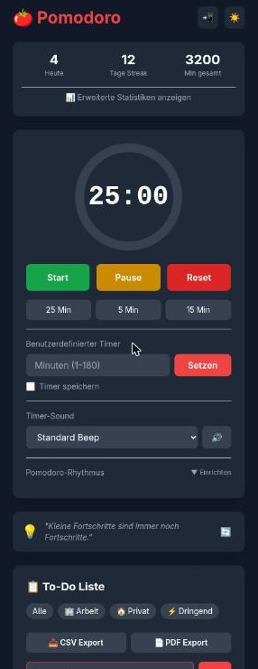
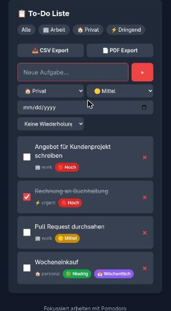

# Pomodoro Focus

Ein Pomodoro-Timer mit Aufgabenliste und Statistik, der **vollständig im Browser
läuft**. Kein Konto, kein Server, keine Datenübertragung — alles liegt im
`localStorage` deines Geräts.

[](LICENSE)
[](#installieren)
[](#wo-die-daten-liegen)

<p align="center">
  
  &nbsp;&nbsp;
  
</p>

<p align="center"><sub>Screenshots aus der laufenden App mit Beispieldaten.</sub></p>

> *A Pomodoro timer with a to-do list and statistics that runs entirely in the
> browser — no account, no server, no data leaving the device. The interface is
> in German.*

## Funktionen

- **Timer** mit 25/5/15 Minuten und frei einstellbaren Längen, die sich
  speichern lassen
- **Läuft im Hintergrund weiter** — der Countdown liegt in einem Web Worker und
  wird an einen Zeitstempel gebunden, überlebt also auch einen Tab-Wechsel oder
  ein gesperrtes Telefon
- **Aufgabenliste** mit Kategorien, Prioritäten, Fälligkeitsdatum und
  Wiederholungen (täglich, wöchentlich, monatlich)
- **Statistik** — Sessions heute, Streak, Gesamtminuten, dazu ein
  Wochendiagramm und eine Heatmap der letzten zwölf Wochen
- **Export** der Aufgaben als CSV oder PDF
- **Export der Statistik** als CSV — jeder Tag seit dem ersten mit einer Zeile,
  Tage ohne Sitzung als Nullzeile, damit die Datei direkt in ein Diagramm passt
- **Import der Statistik** aus derselben CSV, mit Vorschau vor dem Übernehmen —
  damit der Export nicht nur eine Kopie zum Ansehen ist, sondern eine Sicherung
- **Pomodoro-Rhythmus** — Abfolge aus Arbeits- und Pausenblöcken einrichten
- **Benachrichtigung und Ton** am Ende einer Session
- **Zitat des Tages**, einmal täglich neu
- **Hell und dunkel**, mobil zuerst gebaut
- **Offline nutzbar** und als App installierbar

## Ausprobieren

Es reicht ein beliebiger statischer Webserver auf dem `public/`-Ordner:

```bash
git clone https://github.com/Mario-Mohar/pomodoro-focus.git
cd pomodoro-focus
npm start          # startet einen statischen Server auf Port 3000
```

Ohne Node geht es genauso:

```bash
cd public && python3 -m http.server 3000
```

Dann `http://localhost:3000` öffnen. Ein Build-Schritt ist nicht nötig — das
fertige CSS liegt bereits als `public/output.css` bei.

### Installieren

Die App ist eine PWA. Im Browser über „Zum Startbildschirm hinzufügen" bzw. das
Installationssymbol in der Adressleiste installieren; danach läuft sie im
eigenen Fenster und auch offline.

### Am Styling arbeiten

```bash
npm install
npm run watch:css   # Tailwind beobachtet public/input.css
npm run build:css   # einmalig, minifiziert
```

## Wo die Daten liegen

Alles bleibt im `localStorage` des Browsers, unter diesen Schlüsseln:

| Schlüssel | Inhalt |
|-----------|--------|
| `pomodoroTodos` | Die Aufgaben |
| `pomodoroStats` | Sessions, Streak, Minuten, Tagesverlauf |
| `pomodoroRhythm` | Der eingerichtete Arbeits-/Pausen-Rhythmus |
| `customTimers` | Eigene Timer-Längen |
| `pomodoroTimer` | Der Stand eines laufenden Timers |
| `theme` | Hell oder dunkel |
| `dailyQuote`, `dailyQuoteDate` | Das Zitat des Tages |
| `onboarding_done` | Ob die Einführung gezeigt wurde |

Daraus folgt zweierlei. Es gibt keine Registrierung, keine Cookies und nichts,
was das Gerät verlässt — aber auch keine Synchronisierung zwischen Geräten. Wer
die Browserdaten löscht, löscht die Aufgaben mit. Der Export ist deshalb
zugleich die Sicherung — für die Aufgaben als CSV oder PDF, für die
Sitzungsdaten als CSV unter „Erweiterte Statistiken". Ohne ihn führte der
einzige Weg an die eigenen Zahlen über die Entwicklerkonsole.

Die Statistik-CSV sieht so aus:

```csv
Datum,Sessions,Minuten
2026-08-27,4,100
2026-08-28,0,0
2026-08-29,6,150
```

Dieselbe Datei liest die App über „📥 CSV einlesen" wieder ein. Zusammengeführt
wird **je Tag, die Datei gewinnt**: Tage aus der Datei überschreiben, Tage die
nur lokal existieren bleiben stehen. Eine Nullzeile ist dabei eine Aussage und
keine Lücke — steht in der Datei für einen Tag `0,0`, war an dem Tag nichts, und
lokale Zahlen für diesen Tag verschwinden.

Vor dem Übernehmen zeigt die App, was passieren würde: wie viele Tage neu
dazukommen, wie viele unverändert bleiben, wie viele überschrieben und wie viele
geleert werden. Erst danach wird geschrieben.

Gesamtzahlen und Streak werden anschließend aus der Historie neu berechnet,
damit die Kachel nicht etwas anderes zeigt als die Heatmap. Eine kaputte Zeile
führt zum Abbruch mit Angabe der Zeilennummer — lieber gar nichts einspielen als
die Hälfte.

Die Aufgaben lassen sich nicht zurücklesen; dort stellen sich eigene Fragen
(IDs, Erledigt-Status), und das PDF ist ohnehin kein Eingabeformat.

## Aufbau

```
public/
  index.html         Oberfläche
  app.js             Timer, Aufgaben, Statistik, Speicherung
  timer-worker.js    Web Worker für den Countdown
  sw.js              Service Worker (Offline-Betrieb)
  manifest.json      PWA-Manifest
  input.css          Tailwind-Quelle
  output.css         gebautes CSS (eingecheckt)
  offline.html       Ersatzseite ohne Netz
tailwind.config.js
```

Es gibt bewusst keinen Server-Ordner: Aufgaben, Statistik und Einstellungen
werden direkt in `app.js` gegen den `localStorage` geschrieben.

## Herkunft

Diese App ist der herausgelöste Kern eines größeren, kostenpflichtigen
Pomodoro-Produkts. Für diese Fassung sind Konten, Zahlungsabwicklung, Server
und Datenbank entfernt worden; die verbliebenen Funktionen sind vollständig und
kostenlos nutzbar. Dass hier etwas herausgetrennt wurde, merkt man an einigen
englischen Bezeichnern im Code — der Rest ist auf Deutsch.

## Lizenz

MIT — siehe [LICENSE](LICENSE).
